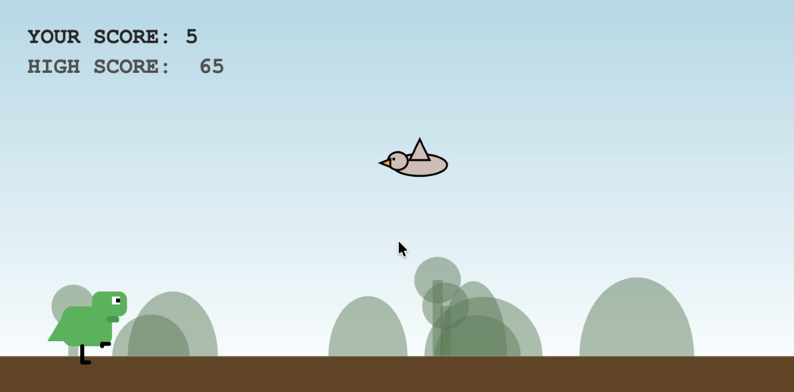
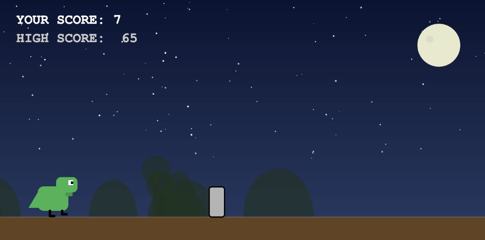
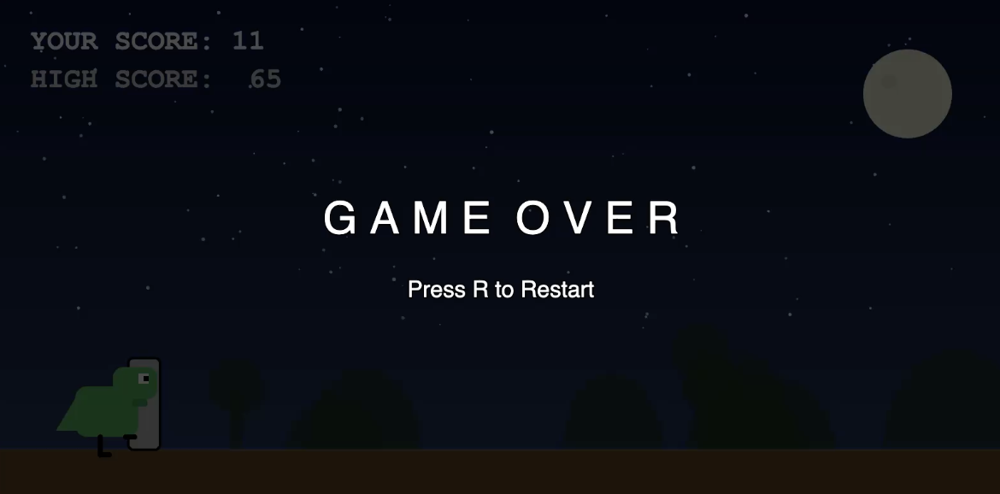
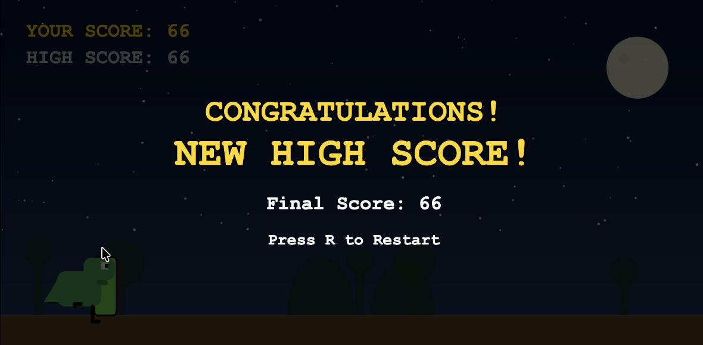

# 🦖 Dino Adventure: A Retro-Modern Side Scroller
[](https://p5js.org/)


Welcome to **Dino Adventure**! This is a high-paced, endless runner built with the **p5.js** library. As a developer and UI designer, I focused on creating a seamless user experience through smooth sprite animations, parallax scrolling, and an adaptive visual state machine.

---

## 🎮 Interface & Gameplay Previews

I designed the UI to be clean and high-contrast, ensuring legibility across both Day and Night modes.

| ☀️ Day Mode | 🌙 Night Mode | 🏆 Achievement |
| :---: | :---: | :---: |
|  |  |  |
| *Level 1: Pastel Blue Sky* | *Level 2: Deep Midnight* | *Dynamic Gold Overlay* |

### 💀 Game Over States
| Ground Collision | High Score Achievement |
| :---: | :---: |
|  |  |

---

## 🔥 Key Technical Features

* **Advanced Audio Feedback:** Implemented a reactive audio engine. Each action (Jumping, High-Score) has its own signature sound. Most importantly, I’ve added a **unique audio trigger specifically for Bird collisions**.
* **Parallax Background System:** Simulated depth by engineering a multi-layered background where hills and trees move at varying speeds relative to the player.
* **Dynamic UI Color Adaptation:** The scoreboard and interface colors dynamically flip between dark and light themes based on the environment level to maintain 100% accessibility.
* **Responsive Collision Physics:** Custom AABB (Axis-Aligned Bounding Box) collision detection ensures fair hitboxes for both static and animated entities.
* **Environmental State Machine:** The game transitions between "Day" and "Night" palettes dynamically, updating the star field, moon, and lighting based on level progression.

---

## 🕹️ Controls & Mechanics

* **Jump:** Press `Spacebar` or `Left Click` to dodge cacti.
* **High Jump:** `Double-Click` or tap twice rapidly to leap over high-flying birds.
* **Restart:** Hit the `R` key post-game over to re-initialize the game state.

---

## 🛠️ Tech Stack

 

 


---

## 🚀 Installation & Local Setup

1. **Clone the repository:**
   ```bash
   git clone [https://github.com/anaTuli133/bingoGame.git](https://github.com/anaTuli133/bingoGame.git)

---

## 📄 License
This project is open-source and available under the [MIT License](LICENSE).

---

**Developed by:** [Anamika Saha](https://github.com/anaTuli133)
