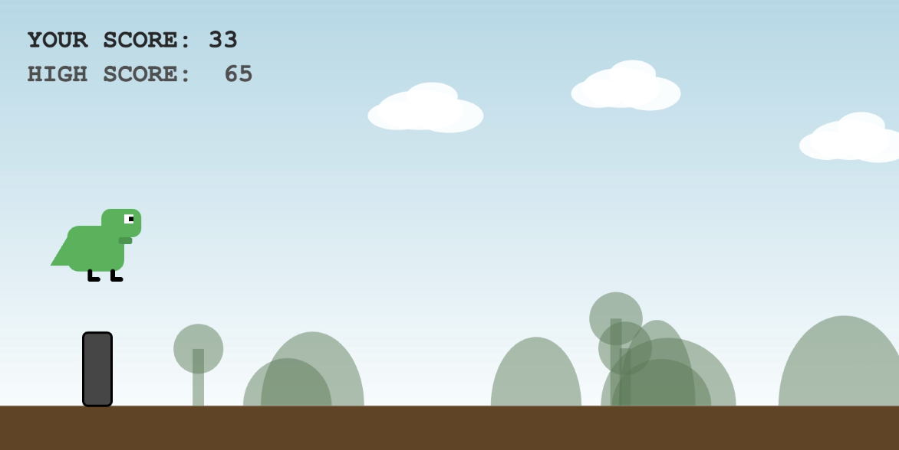

# 🦖 Dino Adventure - Side Scroller Game

A classic, endless runner game built using the **p5.js** library. This game features a dynamic day/night cycle, colorful enemies and challenging obstacles.

---

## 🎮 Game Preview

| Level 1: Day Mode | Level 2: Night Mode |
| :---: | :---: |
|  |  |
| **Action: High Jump** | **Status: Game Over** |
|  |  |

---

## ✨ Features
* **Dynamic Day/Night Cycle:** The environment transitions between day and night based on the player's level/score.
* **Parallax Background:** Layered background elements (hills and trees) move at different speeds to create a sense of depth.
* **Randomized & Colorful Enemies:** Each bird and obstacle spawns with a unique, solid color.
* **Movement Mechanics:** * **Jump:** Press Space to dodge ground obstacles.
    * **High Jump:** Double-click or tap quickly to jump higher over birds.
* **Clean UI:** Minimalist score and high-score display that adapts to background colors.

---

## 🕹️ How to Play
1.  **Jump:** Press the **Spacebar** or **Left Click**.
2.  **High Jump:** **Double-click** or tap the screen twice quickly.
3.  **Restart:** Press the **'R'** key after a Game Over to try again.

---

## 🛠️ Tech Stack


  
  
  

---

## 🚀 Installation & Local Setup
To run this game on your local machine:
1.  Clone the repository:
    ```bash
    git clone [https://github.com/anaTuli133/bingoGame.git](https://github.com/anaTuli133/bingoGame.git)
    ```
2.  Navigate to the project folder.
3.  Open `index.html` in any modern web browser.

---

## 📄 License
This project is open-source and available under the [MIT License](LICENSE).

---

**Developed by:** [Anamika Saha](https://github.com/anaTuli133)
