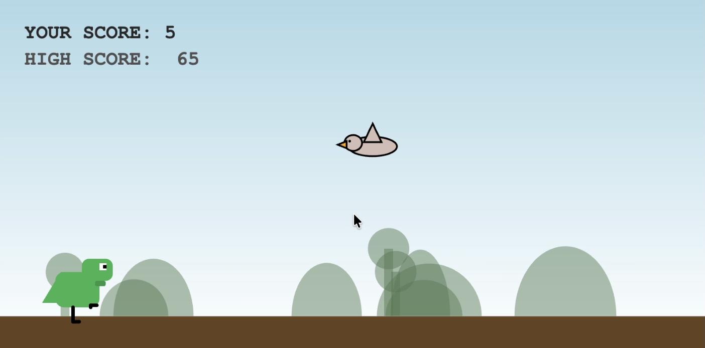
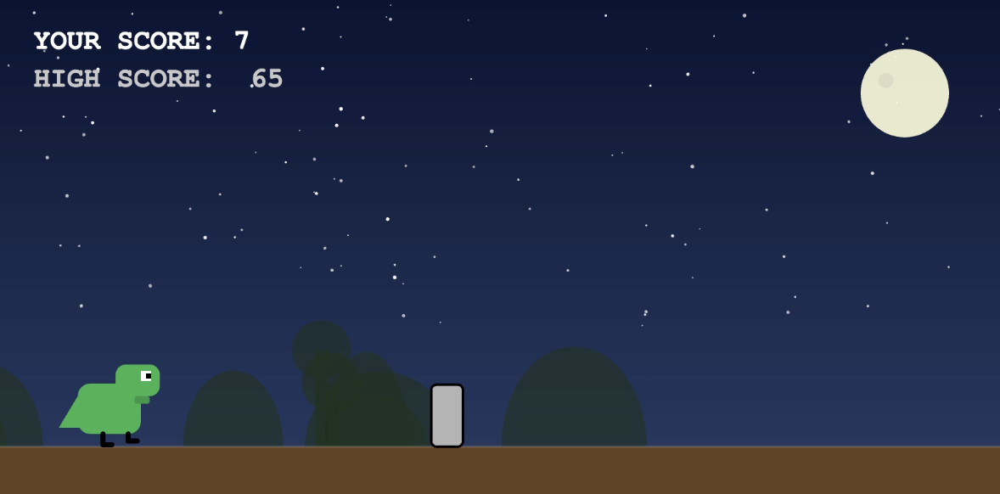
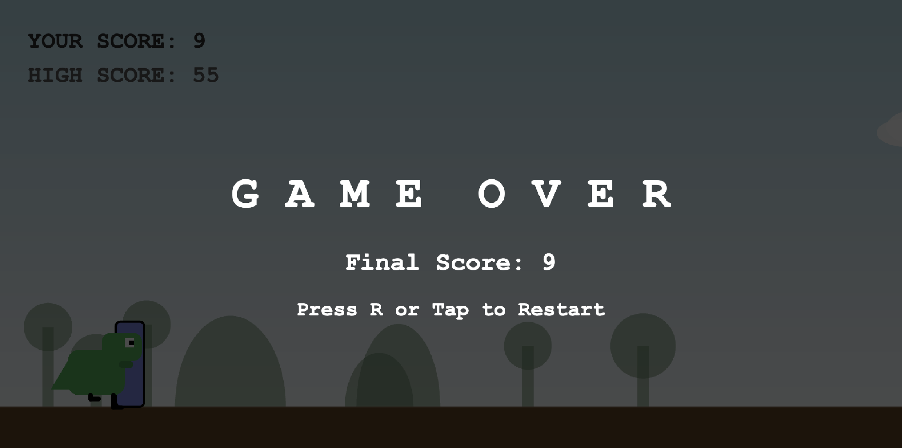
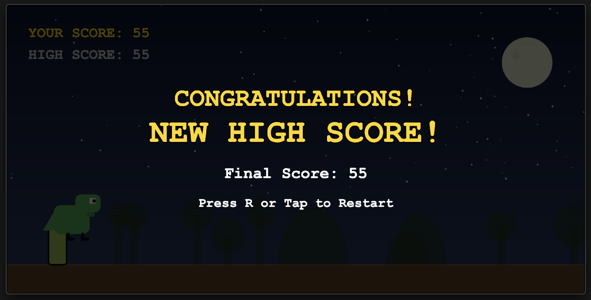

# 🦖 Dino Adventure: A Retro-Modern Side Scroller
[](https://p5js.org/)


Welcome to **Dino Adventure**! This is a high-paced, endless runner built with the **p5.js** library. I focused on creating a seamless user experience through smooth sprite animations, parallax scrolling, and an adaptive visual state machine.

---

## 🎮 Interface & Gameplay Previews

I designed the UI to be clean and high-contrast, ensuring legibility across both Day and Night modes.

| ☀️ Day Mode | 🌙 Night Mode | 
| :---: | :---: | 
|  |  |
| *Level 1: Pastel Blue Sky* | *Level 2: Deep Midnight* | 

### 💀 Game Over States
| Ground Collision | High Score Achievement |
| :---: | :---: |
|  |  |

---

## 🔥 Key Technical Features

* **📱 Mobile-Optimized UX:**
    * **Smart Orientation Detection:** Prompts users to rotate their phones if they are in portrait mode.
    * **5-Second Countdown:** Gives users a grace period to get ready after rotating the screen.
    * **Double-Tap Fullscreen:** Uses the Web API to toggle immersive fullscreen mode via a rapid double-tap.
* **🎭 Parallax Background:** Multi-layered scrolling (clouds, trees, hills) that moves at different speeds to simulate 3D depth.
* **📈 Dynamic Difficulty:** As your score increases, the game speed accelerates and obstacle spacing tightens.
* **🔊 Immersive Audio Engine:** Custom sound effects for jumping, hitting obstacles, bird encounters, and breaking high scores.
* **🌗 Environmental States:** Real-time color palette shifting between levels (Day vs. Night) to keep the gameplay fresh.

---

## 🕹️ Controls & Mechanics

| Action | PC (Keyboard) | Mobile (Touch) |
| :--- | :--- | :--- |
| **Start Game** | `Enter` | Single Tap (after 5s) |
| **Normal Jump** | `Space` / `Enter` | Single Tap |
| **High Jump** | N/A | Rapid Double Tap |
| **Toggle Fullscreen**| N/A | Double Tap |
| **Restart Game** | `R` Key | Tap on Game Over Screen |

---

## 🛠️ Tech Stack

 

 


---

## 🚀 Installation & Local Setup

1. **Clone the repository:**
   ```bash
   git clone [https://github.com/anaTuli133/bingoGame.git](https://github.com/anaTuli133/bingoGame.git)

---

## 📄 License
This project is open-source and available under the [MIT License](LICENSE).

---

**Developed by:** [Anamika Saha](https://github.com/anaTuli133)
